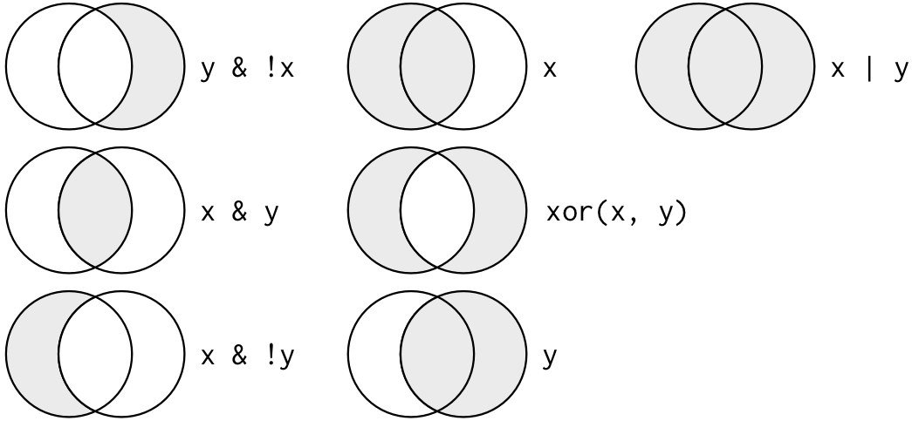

# Working with Data in R and RStudio

In this chapter, you'll learn:

- How top load data into R
- How to read a **data frame**
- How to manipulate, filter, and summarize **data frames**

**Pre-requisite:**

- The tidyverse installed

## Loading Data

On its own, R does not store any data; we have to add the data we want to analyze. The most common way to do this is to **import** a data file you have on your computer into R's memory.

With the `tidyverse` installed, an easy way to accomplish this is through one of `readr`'s **read** functions (*e.g.,* `read_tsv` or `read_csv`).

Another method is to use datasets that certain packages come with. For example `ggplot2`, a package aimed at helping you build graphics, comes with a dataset called `mpg`, a collection observations collected by the EPA on 38 models of cars between the years 1999 and 2008.

## Understanding Data Frames

After loading either the `tidyverse` or `ggplot2` library, we can investigate the contents of the `mpg` dataset by typing "mpg" into the console and pressing Enter.

```{r}
library(tidyverse)
```

```{r}
mpg
```

`mpg` is what we call a **data frame**, a rectangular collection of **variables** (*columns*) and **observations** (*rows*). Specifically, within the `tidyverse`, it is a more specialized version of a **data frame**, what we call a **tibble**. The `mpg` **data frame** consists of 11 total **variables** across 234 **observations** (*i.e.,* types of cars).

Among the **variables** (*columns*) in `mpg` are:

- `manufacturer`, the car’s manufacturer

- `model`, the model of the car

- `displ`, a car’s engine size, in liters (the total displacement of the engine)

- `year`, the model year of the car

- `cyl`, the total number of cylinder in the car’s engine

- `trans`, the type of transmission the car uses.

  - You may notice that certain car models have several different transmissions in the same year. This is because some cars will make an automatic and manual transmission in the same car.

- `drv`, the drive train of the car. `f` represents “front-wheel drive”, `4` for “four-wheel drive”, and `r` for “rear-wheel drive”

- `cty`, the city mileage (miles per gallon, mpg) of the car

- `hwy`, the highway mileage of the car

- `fl`, the fuel type of the car. `p` represents “premium”, `e` represents “ethanol (E85)”, `r` represents “regular”, `d` represents “diesel”, and `c` represents “compressed natural gas”.

  - You may notice tat certain car models have several different fuel types in the same year. This is because some cars allow for the use of ethanol or regular fuel, each fuel type having its own efficiency, so they need to be separate rows.

- `class`, the type of vehicle. Can be `compact`, `midsize`, `suv`, `2seater`, `minivan`, `pickup`, or `subcompact`

To learn more about `mpg`, you can open its help page by running `?mpg`.

#### Data Types {.unnumbered}

You may have noticed that each **variable** (*column*) has a series of three letters flanked by `<>`. These are brief descriptions as to the type of data in that row. The types of data that can exist in R are:

- **Basic Types:**

  - Character, `<chr>`: Text strings or individual characters (*e.g.*, `"protein"`)

  - Double, `<dbl>`: Numbers with a decimal (*e.g.,* `1.5`)

  - Integer, `<int>`: Whole numbers (*e.g.*, `1`)

  - Logical, `<lgl>`: Boolean values (`TRUE` or `FALSE`)

  - Complex, `<cpl`: Numbers with real and imaginary parts (*e.g.*,
    `2+3i`)

  - Raw, `<raw>`: Raw bytes of data

- **Dates and Times:**

  - Date, `<date>`: Calendar dates (*e.g.*, `2026-07-08`)

  - Date-Time, `<dttm>`: Date with an associated calendar time and timezone

  - Duration, `<drtn>`: Time spans or time differences.

- **Special R Objects:**

  - Factor, `<fact>`: Categorical variables with predefined categories (levels)

  - Ordered Factor, `<ord>`: Categorical variables with a specific hierarchical order

  - List-column, `<list>`: Columns that contain lists, allowing you to nest data frames, vectors, or complex objects inside a single cell.

## Data Filtering

The function `filter()` from the `dplyr` package lets you use a **logical test** to extract specific *rows* from a *data frame*. To use `filter()`, pass it the *data frame* followed by one or more **logical tests**. `filter()` will return every *row* that passes *each* **logical test**.

So for example, we can use `filter()` to select every car in `mpg` that was made by Audi in 2008, as shown below:

```{r}
filter(mpg, manufacturer == 'audi', year == 2008)
```

Like all `dplyr` functions, `filter()` returns a *new* **data frame** for you to save or use. **It doesn’t overwrite the old data frame**.

If you want to **save** the *output* of `filter()`, you’ll need to use the **assignment** operator, `<-`.

This time, we'll re-run the same `filter()` command as above, but arrange the code just a little to **save** the *output* to an *object* named `audi_2008`.

```{r}
audi_2008 <- filter(mpg, manufacturer == 'audi', year == 2008)

audi_2008
```

Did you notice that this code used the double equal operator, `==`? `==` is one of R’s **logical comparison** operators. Comparison operators are key to using `filter()`, so let’s take a look at them.

### Comparison Operators

R provides a suite of comparison operators that you can use to compare values: `>`, `>=`, `<`, `<=`, `!=` (not equal), and `==` (equal). Each creates a **logical test**. For example, is pi greater than three? We can ask R is that is true.

```{r}
pi > 3
```

Since pi is greater than 3, R will compute that **logical test** as `TRUE` (one of several **boolean** values...more on those in a minute).

When you place a logical test inside of `filter()`, filter applies the test to *each row* in the **data frame** and then returns the *rows that pass*, as a **new** data frame.

Our code above returned every *row* whose manufacturer value was `"audi"` and whose manufacturing year was `2008`.

#### Be Careful! {.unnumbered}

When you start out with R, the easiest mistake to make is to test for equality with `=` instead of `==`. When this happens you’ll get an informative error:

```{r, eval=FALSE}
filter(flights, month = 1)
```

```{r, eval=FALSE}
## Error in `filter()`:
## ! We detected a named input.
## ℹ This usually means that you've used `=` instead of `==`.
## ℹ Did you mean `month == 1`?
```

#### Multiple Tests & Boolean Operators {.unnumbered}

If you give `filter()` *more than one* logical test, `filter()` will **combine** the tests with an implied "**and**". In other words, `filter()` will return **only** the *rows* that return `TRUE` for **every** test.

You can combine tests in other ways with **Boolean operators**

R uses Boolean operators to combine multiple logical comparisons into a single logical test. These include `&` (and), `|` (or), `!` (not or negation), and `xor()` (exactly or).

Both `|` and `xor()` will return `TRUE` if **one or the other** logical comparison returns `TRUE.` `xor()` differs from `|` in that it will return `FALSE` if **both** logical comparisons return `TRUE.` The name `xor` stands for "*exactly or*".

Study the diagram below to get a feel for how these operators work.



In the figure above, `x` is the left-hand circle, `y` is the right-hand circle, and the shaded region show which parts each command selects.

#### Common Mistake: Incomplete Boolean Operators

In R, the order of operations doesn’t work like English. You can’t write:

```{r, eval=FALSE}
filter(mpg, year == 1999 | 2000)
```

Even though in your head you might say “finds all cars made in 1999 or 2000”, R does not understand multiple comparisons in the same way. Be sure to write out a **complete test** on **each side** of a Boolean operator. To fix the above example, we would enter the following:

```{r, eval=FALSE}
filter(mpg, year == 1999 | year == 2000)
```

##### Helpful Tips with Logic Tests and Boolean Operators

1.  A useful short-hand for the above problem is `x %in% y`. This will select every row where *x is one of the values in y*. We could use it to rewrite the code in the question above:

```{r}
filter(mpg, year %in% c(1999, 2000))
```

2.  Sometimes you can simplify complicated sub-setting by remembering De Morgan’s law:

- `!(x & y)` is the same as `!x | !y`
- `!(x | y)` is the same as `!x & !y`

For example, if you wanted to find cars with less than 6 cylinders and had engines less than 2 liters, you could use either of the following two filters:

```{r}
filter(mpg, !(cyl > 6 | displ >= 2))
```

```{r}
filter(mpg, cyl < 6, displ < 2)
```

3.  In addition to `&` and `|`, R also has `&&` and `||`. *Do not* use them with `filter()`!

4.  Whenever you start using complicated, multi-part expressions in `filter()`, consider making them explicit variables instead. This makes it much simpler to check your work.

## Manipulating Data Frames (Data Transformation)

Rarely do you get the data in exactly the right form you need. Often you’ll need to create some new variables or summaries, or maybe you just want to rename the variables or re-order the observations in order to make the data a little easier to work with, which we'll be doing through the `tidyverse` package `dplyr`

In this section, you are going to learn four of the five key `dplyr` functions that allow you to solve the vast majority of your data manipulation challenges (you already learned about `filter()` in the previous section:

- `arrange()`- Reorder the rows
- `select()`- Pick variables by their names
- `mutate()`- Create new variables with functions of existing variables
- `summarize()`- Collapse many values down to a single summary (can also be spelled as `summarise()`)

These can all be used in conjunction with `group_by()` which changes the scope of each function from **operating on the entire dataset** to operating on it **group-by-group**. These six functions provide the **verbs** for a language of data manipulation.

All **verbs** work similarly:

1.  The first argument is a data frame.

2.  The subsequent arguments describe what to do with the data frame, using the variable names (without quotes).

3.  The result is a new data frame.

Together these properties make it easy to chain together multiple simple steps to achieve a complex result. Let’s dive in and see how these verbs work.

### Arrange Rows with `arrange()`

`arrange()` works similarly to `filter()` except instead of *selecting* rows, it changes their *order.* It takes a **data frame** and a set of **column names** (or more complicated expressions) to order by. If you provide more than one column name, each additional column will be used to break ties in the values of preceding columns:

```{r}
arrange(mpg, manufacturer, model, displ, year)
```

Use `desc()` to **re-order by a column** in *descending* order:

```{r}
arrange(mpg, desc(manufacturer))
```

Missing values are always sorted at the end:

```{r}
tibble(x = c(5, 2, NA))
```

```{r}
df <- tibble(x = c(5, 2, NA))

arrange(df, x)
```

```{r}
df <- tibble(x = c(5, 2, NA))

arrange(df, desc(x))
```

### Select Columns with `select()`

It’s not uncommon to get datasets with hundreds or even thousands of *variables.* In this case, the first challenge is often narrowing in on the variables you’re actually interested in. `select()` allows you to rapidly zoom in on a useful subset using operations based on the *names of the variables*.

```{r}
select(mpg, manufacturer, model, year)
#selects just the columns "manufacturer", "model", and "year"
```

```{r}
select(mpg, manufacturer, model:cyl)
#selects the column "manufacturer" and every column between "model" and "cyl" ("displ", and "year")
```

```{r}
select(mpg, -(displ:drv))
#selects every column EXCEPT the ones between "model" and "drv" ("displ", "year", "cyl", "trans"). Note that the column ranges in this scenario must be in parentheses
```

There are a number of helper functions you can use within `select()`:

- `starts_with("abc")`: matches names that **begin** with “abc”.

- `ends_with("xyz")`: matches names that **end** with “xyz”.

- `contains("ijk")`: matches names that **contain** “ijk”.

- `matches("(.)\\1")`: selects variables that **match** a *regular expression*. This one matches *any variables that contain repeated characters*.

- `num_range("x", 1:3)`: **matches** x1, x2 and x3.

To see a longer list of other functions and more detailed usage, use `?select` for more details.

You can also use `select()` to rename variables, but it’s rarely useful because it drops all of the variables not explicitly mentioned. Instead, use `rename()`, a variant of `select()`, that keeps all the variables that aren’t explicitly mentioned:

```{r}
rename(mpg, make = manufacturer)
```

Another option is to use `select()` in conjunction with the `everything()` helper. This is useful if you have a handful of variables you’d like to move to the start of the data frame.

```{r}
select(mpg, year, model, manufacturer, everything())
```

### Add New Variables with `mutate()`

Besides selecting sets of existing columns, it’s often useful to *add new columns* that are **functions of existing columns**. That’s the job of `mutate()`.

`mutate()` always adds new columns at the **end** of your dataset, so we’ll start by creating a narrower dataset so we can see the new variables.

Remember that when you’re in RStudio, the easiest way to see all the columns is `View()`.

In the code chunk below, you'll see a slightly different format than you're probably used to. Up until now, we've kept all arguments and values for a function on a single line. Sometimes that can start to look quite busy and difficult to understand. Luckily, like mentioned earlier, R does not care about white space, so we can put each value on a new line. In fact, RStudio has a built-in functionality where new lines within a function will be indented to the same spot as the start of the first value. This way, it's a little simpler to understand the code we're reading. (RStudio even has a shortcut (`Alt` + `i`) to bring a new line to the proper indentation)

```{r}
mpg_small <- select(mpg, 
                    manufacturer, 
                    model,
                    displ, 
                    year, 
                    cty, 
                    hwy)

#would be the same if we typed:
#mpg_small <- select(mpg, manufacturer, model, year, cty, hwy)

mutate(mpg_small,
       mileage_diff = hwy - cty,
       cty_mileage_per_ltr = cty / displ,
       hwy_mileage_per_ltr = hwy / displ)
```

You can also refer to columns that you’ve just created:

```{r}
mutate(mpg_small,
       mileage_diff = hwy - cty,
       mileage_diff_per_ltr = mileage_diff / displ)
```

If you only want to keep the new variables (*i.e.*, you do not want any of the old ones), you can use `transmute()`:

```{r}
transmute(mpg,
          cty_mileage_per_ltr = cty / displ,
          hwy_mileage_per_ltr = hwy / displ)
```

#### Useful creation functions

There are many functions for creating new variables that you can use with `mutate()`. The key property is that the function must be **vectorised**: it must take a *vector* of *values* as *input*, *return* a *vector* with the *same number of values* as *output.* T

There’s no way to list every possible function that you might use, but here’s a selection of functions that are frequently useful:

- Arithmetic operators: `+`, `-`,`*`, `/`, `^`

  - These are all vectorised, using the so called “recycling rules”. If one parameter is shorter than the other, it will be automatically extended to be the same length. This is most useful when one of the arguments is a single number: `displ * 3.4`, `cty / 1.5`, etc.

  - Arithmetic operators are also useful in conjunction with the aggregate functions. For example, `x / sum(x)` calculates the *proportion of a total*, and `y - mean(y)` computes the *difference from the mean*.

  - Modular arithmetic: `%/%` (integer division) and `%%` (remainder), where `x == y * (x %/% y) + (x %% y)`.

    - Modular arithmetic is a handy tool because it allows you to break integers up into pieces. For example, in the flights dataset, you can compute hour and minute from dep_time with:

```{r}
transmute(mpg,
          model,
          year,
          millenium = year %/% 1000,
          century_decade_year = year %% 1000)
```

- Logs: `log()`, `log2()`, `log10()`. Logarithms are an incredibly useful transformation for dealing with data that ranges across multiple orders of magnitude.

- Offsets: `lead()` and `lag()` allow you to refer to leading or lagging values.

  - This allows you to compute running differences (*e.g.*, `x - lag(x)`) or find when values change (`x != lag(x)`). They are most useful in conjunction with `group_by()`

```{r}
(x <- 1:10)
lag(x)
lead(x)
```

- Cumulative and rolling aggregates: R provides functions for running sums, products, mins and maxes: `cumsum()`, `cumprod()`, `cummin()`, `cummax()`; and `dplyr` provides `cummean()` for cumulative means.

```{r}
(x <- 1:10)
cumsum(x)
cummean(x)
```

- Logical comparisons (`<`, `<=`, `>`, `>=`, `!=`, and `==`), which you learned about earlier. If you’re doing a complex sequence of logical operations it’s often a good idea to store the interim values in new variables so you can check that each step is working as expected.

- Ranking: there are a number of ranking functions, but you should start with `min_rank()`. It does the most usual type of ranking (*e.g.*, 1st, 2nd, 2nd, 4th). The default gives smallest values the small ranks; use `desc(x)` to give the largest values the smallest ranks.

```{r}
(y <- c(1, 2, 2, NA, 3, 4))
min_rank(y)
min_rank(desc(y))
```

### Grouped Summaries with `summarize()`

The last key verb is `summarise()`. It collapses a data frame to a single row:

```{r}
summarise(mpg, 
          mean_hwy = mean(hwy, na.rm = TRUE))
```

(We’ll come back to what that `na.rm = TRUE` means very shortly.)

`summarise()` is not terribly useful unless we pair it with `group_by()`. This **changes the unit of analysis** from the *complete dataset* to *individual groups*. Then, when you use the `dplyr` verbs on a *grouped data frame* they’ll be automatically *applied “by group”*. For example, if we applied the exact same code to a data frame **grouped by** car manufacturer, we get the average highway mileage per manufacturer:

```{r}
by_make <- group_by(mpg, manufacturer)
summarise(by_make, 
          mean_hwy = mean(hwy, na.rm = TRUE))
```

Together, `group_by()` and `summarise()` provide one of the tools that you’ll use most commonly when working with `dplyr`: **grouped summaries**.

But before we go any further with this, we need to introduce a powerful new idea: the **pipe**.

#### Combining Multiple Operations With the Pipe

Imagine that we want to explore the relationship between the city and highway mileage for each engine size. Using what you know about `dplyr`, you might write code like this:

```{r}
by_engine <- group_by(mpg, displ)
mileage <- summarise(by_engine,
                     count = n(),
                     hwy_mean = mean(hwy, na.rm = TRUE),
                     cty_mean = mean(cty, na.rm = TRUE)
)

mileage <- filter(mileage,
                  count > 1)

ggplot(data = mileage, 
       mapping = aes(x = hwy_mean, y = cty_mean)) +
  geom_point(aes(color = displ,
                 size = count)) +
  geom_smooth(se = FALSE)
```

There are three steps to prepare this data:

1.  Group cars by engine size

2.  Summarize to compute average city and highway mileage, and number of cars with each engine size

3.  Filter to remove noisy points (*i.e.,* engine sizes with only one car)

This code is a little frustrating to write because we have to give each intermediate data frame a name, even though we don’t care about it. Naming things is hard, so this slows down our analysis and can lead to additional errors.

There’s another way to tackle the same problem: with the **pipe** (`%>%`):

```{r}
mileage <- mpg %>% 
  group_by(displ) %>% 
  summarize(count = n(),
            hwy_mean = mean(hwy, na.rm = TRUE),
            cty_mean = mean(cty, na.rm = TRUE)) %>% 
  filter(count > 1)

ggplot(data = mileage,
       mapping = aes(x = hwy_mean, y = cty_mean)) +
  geom_point(aes(color = displ,
                 size = count)) +
  geom_smooth(se = FALSE)
```

```{r}
mpg %>% 
  group_by(displ) %>% 
  summarize(count = n(),
            hwy_mean = mean(hwy, na.rm = TRUE),
            cty_mean = mean(cty, na.rm = TRUE)) %>% 
  filter(count > 1) %>% 
  ggplot(mapping = aes(x = hwy_mean, y = cty_mean)) +
  geom_point(aes(color = displ,
                 size = count)) +
  geom_smooth(se = FALSE)
```

This focuses *on the transformations*, not *what’s being transformed*, which makes the code easier to read. You can read it as a series of imperative statements: 

1. Take the `mpg` *data frame* **THEN**

2. Group it by `displ` **THEN**

3. Summarize by the `displ` group **THEN** 

4. Filter the summarized groups **THEN**

5. Plot the results

As suggested by this reading, a good way to pronounce `%>%` when reading code is **“then”**.

Behind the scenes, `x %>% f(y)` turns into `f(x, y)`, and `x %>% f(y) %>% g(z)` turns into `g(f(x, y), z)` and so on. 

You can use the pipe to rewrite multiple operations in a way that you can read *left-to-right*, *top-to-bottom*. We’ll use **piping** frequently from now on because it considerably improves the readability of code.

Working with the **pipe** is one of the key criteria for belonging to the *tidyverse.* The only exception is `ggplot2`...it was written before the pipe was discovered.

#### Missing values

You may have wondered about the `na.rm` argument we used above. What happens if we don’t set it?

While the `mpg` dataset may not be the best example of missing values (they are none in the data frame), we can still discuss some of the key components pertaining to them. 

As a basic rule, when aggregating missing values, "*if there are any missing values in the input, the output will be a missing value*". 

Fortunately, all aggregation functions have an `na.rm` argument which removes the missing values prior to computation:

#### Useful summary functions

Just using *means*, *counts*, and *sum* can get you a long way, but R provides many other useful summary functions:

- Measures of location: we’ve used `mean(x)`, but you can also use `median(x)`

  - It’s sometimes useful to combine aggregation with logical sub-setting

```{r}
mpg %>% 
  group_by(model) %>% 
  summarise(avg_hwy = mean(hwy),
            avg_2L_hwy = mean(hwy[displ > 2])) #the mean highway mileage of only cars with an engine larger than 2 liters
```

- Measures of spread: 
  - `sd(x)`- Standard deviation, the root mean squared deviation
  - `IQR(x)`- Interquartile range
  - `mad(x)`- Median absolute deviation

```{r}
mpg %>% 
  group_by(model) %>% 
  summarise(hwy_sd = sd(hwy)) %>% 
  arrange(desc(hwy_sd))
```

- Measures of rank: `min(x)`, `quantile(x, 0.25)`, `max(x)`. Quantiles are a generalization of the median. For example, `quantile(x, 0.25)` will find a value of x that is greater than 25% of the values, and less than the remaining 75%.

```{r}
mpg %>% 
  group_by(manufacturer) %>% 
  summarise(guzzler = min(hwy),
            effiicient = max(hwy))
```


- Counts: `n()` returns the size of the current group. 
  - To count the number of non-missing values, use `sum(!is.na(x))` 
  - To count the number of distinct (unique) values, use `n_distinct(x)`

```{r}
mpg %>% 
  group_by(manufacturer, model) %>% 
  summarise(n_model_years = n_distinct(year)) %>% 
  arrange(desc(n_model_years))
```

  - Counts are so useful that `dplyr` provides a simple helper if all you want is a count:

```{r}
mpg %>% 
  filter(grepl('auto', trans), #keep any row that contains the string "auto" in the `trans` column
         drv =='f',
         cyl == 6) %>% 
  group_by(manufacturer, model) %>% 
  count(model) #The number of times a car model was released that has an automatic transmission, is front-wheel drive, and has 6 cylinders
```

#### Ungrouping

If you need to remove grouping, and return to operations on un-grouped data, use `ungroup()`.

```{r}
grouped_mpg <- mpg %>% 
  group_by(manufacturer, model)

grouped_mpg %>% 
  ungroup() %>% 
  summarise(n_model_years = n()) 
```
